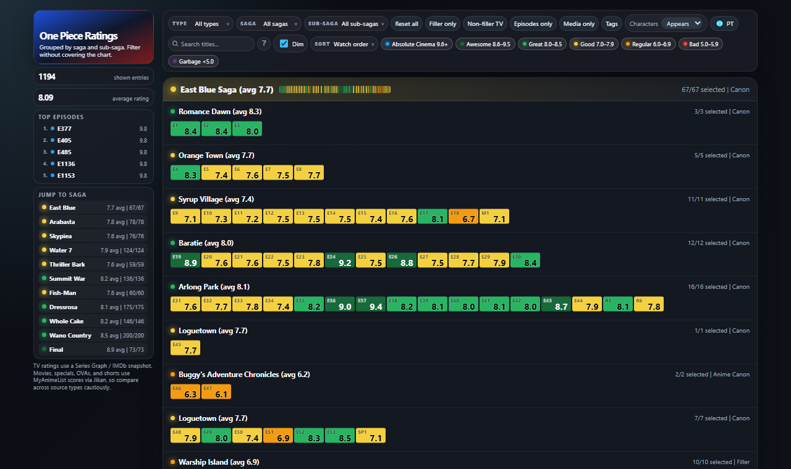
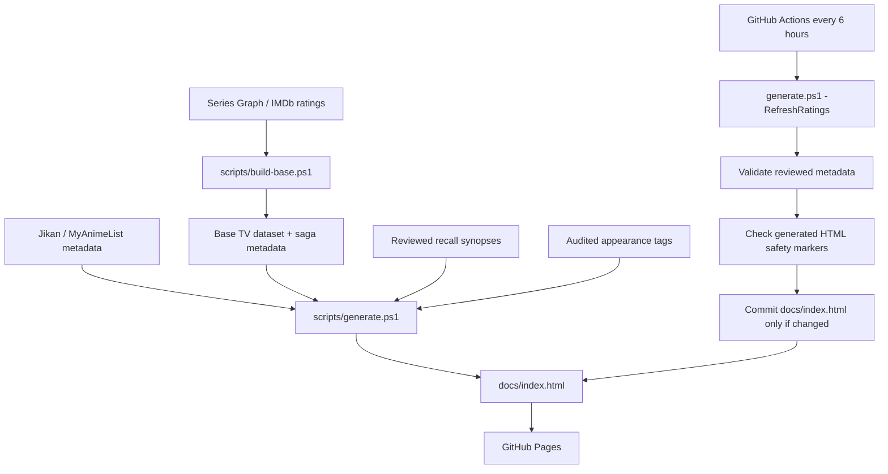

# One Piece Ratings Timeline

A deployed, PowerShell-generated static ratings explorer for One Piece episodes, movies, specials, OVAs, shorts, and recap/remake entries.

**Live demo:** https://victormends.github.io/one-piece-ratings-timeline/



The project builds a searchable GitHub Pages site from multiple public data sources: Series Graph / IMDb for TV ratings and Jikan / MyAnimeList for titles, dates, metadata, and non-TV scores. A scheduled GitHub Actions workflow refreshes the generated page every six hours, validates reviewed metadata, checks generated HTML safety markers, and commits only when the published artifact changes.

This is an unofficial fan research project. It is not affiliated with One Piece, Toei Animation, IMDb, Series Graph, MyAnimeList, or Jikan.

## What It Does

- Groups TV episodes and related media by saga, sub-saga, type, rating tier, and watch-order placement.
- Provides a deployed GitHub Pages interface with saga navigation, filters, sorting, tooltips, rating tiers, and EN/PT UI support.
- Keeps filtered-out entries dimmed instead of removed so timeline context remains visible.
- Links entries back to their rating source: IMDb for TV episodes and MyAnimeList for non-TV media.
- Includes structured search for boolean operators, exclusions, episode ranges, saga/category aliases, and audited faction/character tags.

## Engineering Summary

- Static-site pipeline: `scripts/build-base.ps1` builds the base TV dataset; `scripts/generate.ps1` refreshes ratings by default, merges metadata, and emits `docs/index.html`.
- Scheduled refresh: GitHub Actions runs every six hours, rebuilds with `-RefreshRatings`, validates output, and commits only changed generated HTML.
- Multi-source ingestion: Series Graph / IMDb ratings plus Jikan / MyAnimeList titles, dates, metadata, and non-TV scores.
- Audited metadata: `data/appearance-audits.json` models character/faction tags with aliases, focused/appears semantics, flashbacks, remote references, exclusions, and source notes.
- Review gates: recall synopses are generated separately, validated, promoted only when reviewed, and checked before publishing.
- Artifact hygiene: source caches and research drafts stay ignored; reviewed public data and generated page output are versioned intentionally.

## Architecture And Validation

The build path separates source ingestion, reviewed metadata, generated output, and publication so the deployed page can refresh without committing local caches or draft research files.



To rebuild locally:

```powershell
powershell -ExecutionPolicy Bypass -File scripts\generate.ps1
powershell -ExecutionPolicy Bypass -File scripts\generate.ps1 -RefreshRatings
powershell -ExecutionPolicy Bypass -File scripts\generate.ps1 -UseCachedRatings
powershell -ExecutionPolicy Bypass -File scripts\validate-original-notes.ps1 -PublicFile
powershell -ExecutionPolicy Bypass -File scripts\verify-appearance-tags.ps1
git status --short --ignored
```

Use `-UseCachedRatings` only for offline local iteration. A normal generator run refreshes the ignored Series Graph cache first so manual commits do not replace the six-hour bot snapshot with stale local rating or episode data.

Repository layout:

```text
docs/index.html                  generated GitHub Pages artifact
scripts/build-base.ps1           base TV dataset builder
scripts/generate.ps1             final static page generator
scripts/validate-original-notes.ps1
scripts/verify-appearance-tags.ps1
data/original-entry-notes.json   reviewed public synopsis data
data/appearance-audits.json      audited character/faction metadata
DATA_LICENSE.md                  upstream data boundaries
SUMMARY_POLICY.md                recall synopsis policy
sources.md                       source and classification notes
```

The scheduled workflow also rejects generated output containing stale UI labels or unsafe tooltip HTML markers.

## Data Sources And Governance

The repository separates original code/docs from upstream-derived data. Code is MIT-licensed; third-party ratings, titles, dates, URLs, vote counts, and source-derived recall synopses remain subject to their upstream sources.

See:

- `sources.md`
- `DATA_LICENSE.md`
- `SUMMARY_POLICY.md`

## Limitations

- TV and non-TV ratings come from different upstream sources, so cross-type comparisons are approximate.
- Series Graph can lag live IMDb or round values differently.
- Recall synopses are source-derived and should be reviewed as upstream data, not original prose.
- Validation may warn on repeated synopsis openings; those warnings are quality-review prompts, not publish blockers.
- Non-episode media placement is practical watch-order guidance, not strict canon continuity.

## Public Release Checklist

Before tagging a public release, verify:

- The GitHub Pages demo opens and matches the current repository state closely enough for the README screenshot to remain representative.
- `scripts/validate-original-notes.ps1 -PublicFile` reports no errors.
- `scripts/verify-appearance-tags.ps1` reports no errors; warnings should be reviewed as metadata-quality prompts.
- The scheduled refresh workflow is healthy or any temporary upstream/source issue is documented in the release notes.
- `DATA_LICENSE.md`, `SUMMARY_POLICY.md`, and `sources.md` still describe the current data-source boundaries.
- Release notes avoid implying official affiliation or ownership of upstream ratings, titles, metadata, or source-derived synopsis text.

## License

Code and original project documentation are MIT-licensed. Upstream-derived ratings, titles, metadata, URLs, vote counts, and source-derived recall synopses are not covered by the MIT license.
