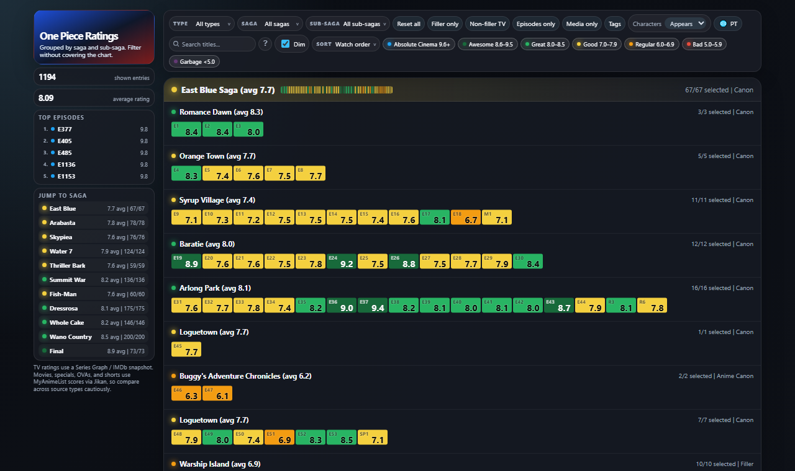
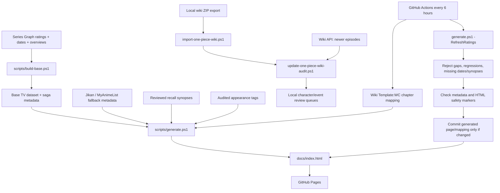

# One Piece Ratings Timeline

A deployed, PowerShell-generated static ratings explorer for One Piece episodes, movies, specials, OVAs, shorts, and recap/remake entries.

**Live demo:** https://victormends.github.io/one-piece-ratings-timeline/



The project builds a searchable GitHub Pages site from multiple public data sources: Series Graph / IMDb for TV ratings, titles, dates, and short source overviews; Jikan / MyAnimeList for fallback episode metadata and non-TV scores; and One Piece Wiki data for chapter-adaptation links and local coverage audits. A scheduled GitHub Actions workflow refreshes the generated page every six hours, rejects partial provider responses and coverage regressions, and commits only when the validated artifact changes.

This is an unofficial fan research project. It is not affiliated with One Piece, Toei Animation, IMDb, Series Graph, MyAnimeList, or Jikan.

## What It Does

- Groups TV episodes and related media by saga, sub-saga, type, rating tier, and watch-order placement.
- Provides a deployed GitHub Pages interface with saga navigation, filters, sorting, tooltips, rating tiers, and EN/PT UI support.
- Keeps filtered-out entries dimmed instead of removed so timeline context remains visible.
- Links entries back to their rating source: IMDb for TV episodes and MyAnimeList for non-TV media.
- Links each mapped TV episode to the manga chapter or chapters it adapts, including the source page ranges.
- Includes structured search for boolean operators, exclusions, episode ranges, saga/category aliases, and audited faction/character tags.

## Engineering Summary

- Static-site pipeline: `scripts/build-base.ps1` builds the base TV dataset; `scripts/generate.ps1` refreshes ratings by default, merges metadata, and emits `docs/index.html`.
- Scheduled refresh: GitHub Actions runs every six hours, restores the last known-good provider snapshots, retries transient failures, validates output, and commits only changed generated HTML.
- Multi-source ingestion: Series Graph / IMDb ratings, titles, dates, and overview text plus Jikan / MyAnimeList fallback metadata and non-TV scores.
- Audited metadata: `data/appearance-audits.json` models character/faction tags with aliases, focused/appears semantics, flashbacks, remote references, exclusions, and source notes.
- Review gates: curated recall notes remain preferred; empty, template-only, title-only, encoding-damaged, or abbreviation-truncated notes fall back to a short provider overview and retain an explicit `synopsisStatus`.
- Wiki coverage audit: the local Fandom export is reduced to section-presence, character/context, and event-signal metadata; an incremental API pass extends that audit to newer episodes without publishing copied wiki summaries.
- Chapter mapping: `scripts/update-chapter-adaptations.ps1` inverts the One Piece Wiki `Template:WC` chapter-to-anime table into a validated episode-to-chapter cache used by tooltips.
- Artifact hygiene: source caches and research drafts stay ignored; reviewed public data and generated page output are versioned intentionally.

## Architecture And Validation

The build path separates source ingestion, reviewed metadata, generated output, and publication so the deployed page can refresh without committing local caches or draft research files.


```mermaid
flowchart TD
  A[Series Graph ratings + dates + overviews] --> B[scripts/build-base.ps1]
  B --> C[Base TV dataset + saga metadata]
  D[Jikan / MyAnimeList fallback metadata] --> E[scripts/generate.ps1]
  C --> E
  F[Reviewed recall synopses] --> E
  G[Audited appearance tags] --> E
  T[Wiki Template:WC chapter mapping] --> E
  E --> H[docs/index.html]

  O[Local wiki ZIP export] --> P[import-one-piece-wiki.ps1]
  Q[Wiki API: newer episodes] --> R[update-one-piece-wiki-audit.ps1]
  P --> R
  R --> S[Local character/event review queues]

  J[GitHub Actions every 6 hours] --> T
  J --> K[generate.ps1 -RefreshRatings]
  K --> L[Reject gaps, regressions, missing dates/synopses]
  L --> M[Check metadata and HTML safety markers]
  M --> N[Commit generated page/mapping only if changed]
  N --> H
  H --> I[GitHub Pages]
```

To rebuild locally:

```powershell
powershell -ExecutionPolicy Bypass -File scripts\generate.ps1
powershell -ExecutionPolicy Bypass -File scripts\generate.ps1 -RefreshRatings
powershell -ExecutionPolicy Bypass -File scripts\generate.ps1 -RefreshRatings -AllowStaleOnProviderFailure
powershell -ExecutionPolicy Bypass -File scripts\generate.ps1 -UseCachedRatings
powershell -ExecutionPolicy Bypass -File scripts\validate-original-notes.ps1 -PublicFile
powershell -ExecutionPolicy Bypass -File scripts\validate-generated-data.ps1
powershell -ExecutionPolicy Bypass -File scripts\verify-appearance-tags.ps1
git status --short --ignored
```

Use `-UseCachedRatings` only for offline local iteration. `-AllowStaleOnProviderFailure` is intended for automation: it permits a validated cached snapshot after retryable provider failure, but never permits a partial download, missing episode sequence, or regression below the published maximum.

To rebuild the local wiki research audit from the downloaded ZIP and then extend it through the generated catalog:

```powershell
powershell -ExecutionPolicy Bypass -File scripts\import-one-piece-wiki.ps1 -ZipPath "C:\path\to\OnePieceWiki_Pages.zip"
powershell -ExecutionPolicy Bypass -File scripts\update-one-piece-wiki-audit.ps1
powershell -ExecutionPolicy Bypass -File scripts\audit-wiki-coverage.ps1
```

The detailed reports under `data/generated/` remain ignored. The compact, provenance-bearing `data/wiki-audit-summary.json` is versioned so coverage and known missing source sections can be reviewed without committing wiki page text.

Repository layout:

```text
docs/index.html                  generated GitHub Pages artifact
scripts/build-base.ps1           base TV dataset builder
scripts/generate.ps1             final static page generator
scripts/provider-utils.ps1       retry, encoding repair, and synopsis quality helpers
scripts/test-provider-utils.ps1  provider-text regression checks
scripts/validate-generated-data.ps1
scripts/import-one-piece-wiki.ps1
scripts/update-one-piece-wiki-audit.ps1
scripts/update-chapter-adaptations.ps1
scripts/audit-wiki-coverage.ps1
scripts/validate-original-notes.ps1
scripts/verify-appearance-tags.ps1
data/original-entry-notes.json   reviewed public synopsis data
data/appearance-audits.json      audited character/faction metadata
data/quality-baseline.json       non-regression thresholds
data/wiki-audit-summary.json     compact derived wiki coverage/provenance
data/chapter-adaptations.json    chapter/page mappings with source revision
DATA_LICENSE.md                  upstream data boundaries
SUMMARY_POLICY.md                recall synopsis policy
sources.md                       source and classification notes
```

The independent `CI` workflow validates every push and pull request without network access. The scheduled refresh additionally exercises providers and stores its machine-readable quality report as a workflow artifact.

## Data Sources And Governance

The repository separates original code/docs from upstream-derived data. Code is MIT-licensed; third-party ratings, titles, dates, URLs, vote counts, and source-derived recall synopses remain subject to their upstream sources.

See:

- `sources.md`
- `DATA_LICENSE.md`
- `SUMMARY_POLICY.md`

## Limitations

- TV and non-TV ratings come from different upstream sources, so cross-type comparisons are approximate.
- Series Graph can lag live IMDb or round values differently.
- Provider overviews and reviewed recall notes are source-derived and should be reviewed as upstream data, not original prose.
- Wiki character lists include contextual forms such as flashbacks, silhouettes, documents, imagination, and mentions. Automated comparison excludes mention/document-only rows from on-screen coverage math and produces review queues, not automatic truth claims.
- The compact wiki audit records section coverage; it does not reproduce the exported page text.
- Chapter/page mappings are source-derived and can change when the wiki corrects its `Template:WC` table; the cache records the exact upstream revision.
- Validation may warn on repeated synopsis openings; those warnings are quality-review prompts, not publish blockers.
- Non-episode media placement is practical watch-order guidance, not strict canon continuity.

## Public Release Checklist

Before tagging a public release, verify:

- The GitHub Pages demo opens and matches the current repository state closely enough for the README screenshot to remain representative.
- `scripts/validate-original-notes.ps1 -PublicFile` reports no errors.
- `scripts/validate-generated-data.ps1` reports no errors, 100% date/synopsis coverage, and chapter-adaptation coverage above the configured baseline.
- `scripts/verify-appearance-tags.ps1` reports no errors; warnings should be reviewed as metadata-quality prompts.
- The scheduled refresh workflow is healthy or any temporary upstream/source issue is documented in the release notes.
- `DATA_LICENSE.md`, `SUMMARY_POLICY.md`, and `sources.md` still describe the current data-source boundaries.
- Release notes avoid implying official affiliation or ownership of upstream ratings, titles, metadata, or source-derived synopsis text.

## License

Code and original project documentation are MIT-licensed. Upstream-derived ratings, titles, metadata, URLs, vote counts, and source-derived recall synopses are not covered by the MIT license.
